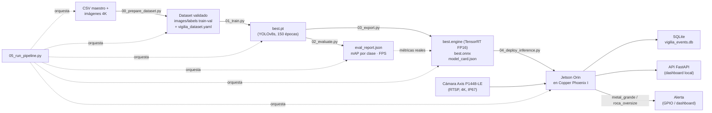

# VIGIL-IA — Arquitectura del Sistema

**Proyecto:** VIGIL-IA (VIGIL SpA) · **CORFO Semilla Inicia** 25INI-282394
**Sitio piloto:** Copper Phoenix I — Barreal Seco, Taltal, Región de Antofagasta (Xplora Minerals, ~1.030 m.s.n.m.)

Plataforma de visión artificial en el borde (edge computing) para monitoreo de cintas transportadoras mineras, capaz de detectar en tiempo real material sobredimensionado (`roca_oversize`) y metal inchancable (`metal_grande`) sin ninguna dependencia de conectividad a internet o servicios en la nube.

---

## 1. Resumen del sistema

| Aspecto | Detalle |
|---|---|
| Modelo | YOLOv8s (Ultralytics), TensorRT FP16, CUDA |
| Clases | `mineral_normal` · `roca_oversize` · `metal_grande` |
| Hardware de inferencia | NVIDIA Jetson Orin (edge, sin nube) |
| Cámara | Axis P1448-LE (IP67, 3840×2160 px, RTSP) |
| Backend de eventos | FastAPI + SQLite |
| Dataset de referencia | 1.720 imágenes (1.200 sintéticas + 520 nativas), split 80/20 |
| Umbral de latencia validado | ≥ 25 FPS en Jetson Orin |
| mAP@0.5 (validación Copper Phoenix I) | global 0,67 · mineral_normal 0,743 · roca_oversize 0,672 · metal_grande 0,490 |
| Modelo comercial | SaaS, USD 1.500/mes por cinta |

---

## 2. Estructura del repositorio

```
vigilia-ia/
├── README.md
├── ARCHITECTURE.md                  # este documento
├── requirements.txt
├── config/
│   └── vigilia_dataset.yaml         # generado por 00_prepare_dataset.py
│
├── data/
│   ├── vigilia_dataset_entrenamiento_completo.csv   # CSV maestro de anotaciones
│   ├── raw_images/                  # imágenes 4K crudas (input)
│   ├── images/{train,val}/          # imágenes preparadas (output de la etapa DATA)
│   ├── labels/{train,val}/          # etiquetas YOLOv8 TXT
│   ├── dataset_summary.json
│   └── vigilia_events.db            # SQLite de eventos en producción
│
├── scripts/
│   ├── 00_prepare_dataset.py        # DATA      — validación y split del dataset
│   ├── 01_train.py                  # TRAIN     — entrenamiento YOLOv8s
│   ├── 02_evaluate.py               # EVAL      — métricas por clase + benchmark FPS
│   ├── 03_export.py                 # EXPORT    — TensorRT FP16 + ONNX + model card
│   ├── 04_deploy_inference.py       # DEPLOY    — motor de inferencia en Jetson Orin
│   └── 05_run_pipeline.py           # ORQUESTADOR — pipeline end-to-end
│
├── runs/
│   ├── train/<run_name>/weights/{best.pt,last.pt}
│   ├── eval/eval_report.json
│   ├── export/{best.engine, best.onnx, model_card.json}
│   └── pipeline_report.json
│
└── docs/
    ├── VIGIL-IA_Informe_Validacion_Tecnica_CORFO.docx
    ├── VIGIL-IA_Informe_Desarrollo_Producto.docx
    └── Anexos_AF.pdf
```

---

## 3. Flujo de datos end-to-end (pipeline)



---

## 4. Módulos y responsabilidades

### 4.1 `00_prepare_dataset.py` — DATA
Valida el CSV maestro contra las imágenes físicas, descarta filas con `class_id` inválido, ejecuta un split 80/20 estratificado por clase dominante y emite la estructura `images/labels` + `vigilia_dataset.yaml` consumida por Ultralytics.

### 4.2 `01_train.py` — TRAIN
Entrena YOLOv8s (150 épocas) delegando el ciclo de optimización en Ultralytics. No fija métricas de antemano: `best.pt`, `last.pt` y las curvas de entrenamiento se generan a partir del resultado real de cada corrida.

### 4.3 `02_evaluate.py` — EVAL
Calcula mAP@0.5 / precisión / recall por clase y mide FPS real sobre el hardware de destino. Expone un modo `--strict` que actúa como gate de CI/CD, calibrado como piso de no-regresión sobre lo logrado en Copper Phoenix I (incluye el umbral ≥25 FPS).

### 4.4 `03_export.py` — EXPORT
Convierte `best.pt` a TensorRT FP16 (`best.engine`, formato de producción en Jetson Orin) y a ONNX (portabilidad). Genera `model_card.json` con trazabilidad completa: clases, umbrales de confianza, hardware objetivo y métricas de `02_evaluate.py`.

### 4.5 `04_deploy_inference.py` — DEPLOY
Motor de inferencia 100% local que corre en el Jetson Orin: consume el stream RTSP, aplica umbrales de confianza diferenciados por clase (`mineral_normal`=0,50 · `roca_oversize`=0,40 · `metal_grande`=0,30), persiste eventos en SQLite, dispara alertas GPIO opcionales y expone una API FastAPI para el dashboard.

### 4.6 `05_run_pipeline.py` — ORQUESTADOR
Encadena las cinco etapas anteriores como subprocesos independientes, propagando artefactos entre ellas (`vigilia_dataset.yaml` → `best.pt` → `eval_report.json` → `best.engine`). Soporta `--skip_deploy` para correr data→export en cualquier entorno con GPU, reservando DEPLOY para el hardware Jetson Orin en terreno.

---

## 5. Lógica de alertas en producción

| Clase | Umbral de confianza | Nivel de riesgo | Acción |
|---|---|---|---|
| `mineral_normal` | 0,50 | Sin riesgo | Log |
| `roca_oversize` | 0,40 | Riesgo | Alerta |
| `metal_grande` | 0,30 | Daño (inchancable) | Alerta |

El umbral reducido en `metal_grande` es una decisión deliberada de diseño: prioriza recall sobre precisión dado el 23,8% de falsos negativos (19/80) observado en validación, bajo la premisa de que una alerta por exceso es más tolerable que un inchancable no detectado.

---

## 6. Stack tecnológico

- **Modelo / entrenamiento:** YOLOv8s, Ultralytics, CUDA
- **Inferencia en producción:** TensorRT FP16, NVIDIA Jetson Orin
- **Captura de video:** Cámara Axis P1448-LE (RTSP, 3840×2160 px, IP67), OpenCV
- **Backend / persistencia:** FastAPI, SQLite
- **Control físico:** GPIO (Jetson.GPIO), alertas sonoras/lumínicas
- **Orquestación:** scripts Python encadenados vía `subprocess`, sin dependencias de infraestructura externa

---

## 7. Principios de diseño

1. **Sin dependencia de nube:** todo el ciclo de captura → inferencia → alerta corre localmente en el Jetson Orin.
2. **Trazabilidad de extremo a extremo:** cada etapa emite un artefacto verificable (`dataset_summary.json`, `train_metadata.json`, `eval_report.json`, `model_card.json`, `pipeline_report.json`); ninguna métrica de negocio se hardcodea.
3. **Fallar rápido y con contexto:** validaciones explícitas de datos e integridad antes de invertir cómputo en entrenamiento.
4. **Degradación segura:** componentes opcionales (GPIO, API) no interrumpen el motor de inferencia si no están disponibles en el entorno.
5. **Separación de entornos:** el ciclo de entrenamiento/validación (GPU de desarrollo) es independiente del ciclo de inferencia en producción (Jetson Orin en terreno), reflejado en la bandera `--skip_deploy`.
