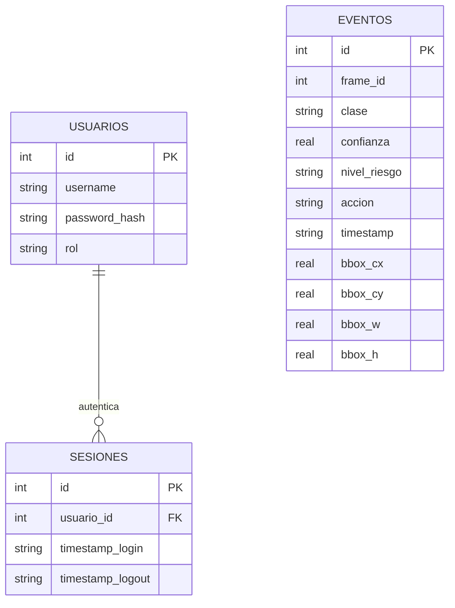

# VIGIL-IA — Documentación del Desarrollo de Backend

**Proyecto:** VIGIL-IA (VIGIL SpA) · **CORFO Semilla Inicia** 25INI-282394
**Hito de referencia:** 3.2 Desarrollo de Backend — Informe de Desarrollo de Producto
**Sitio piloto:** Copper Phoenix I — Barreal Seco, Taltal, Región de Antofagasta

---

## 1. Resumen

El backend de VIGIL-IA es la capa de procesamiento y gestión de datos operativos que corre íntegramente en el nodo edge (NVIDIA Jetson Orin) instalado junto a la cinta transportadora, sin ninguna dependencia de conectividad a internet. Su responsabilidad es recibir las detecciones generadas por el modelo de visión artificial, aplicar la lógica de negocio de alertas, persistirlas de forma trazable, y exponerlas de manera segura al Panel de Detecciones (frontend) mediante una API local.

Corresponde a la implementación del hito **3.2 Desarrollo de Backend** del Informe de Desarrollo de Producto, y se apoya directamente en `04_deploy_inference.py` del pipeline de entrenamiento/despliegue documentado en el Anexo D.

---

## 2. Responsabilidades del backend

Según lo documentado en el hito 3.2, los servicios backend cubren cuatro funciones:

1. **Ingesta del flujo de video** desde la cámara Axis P1448-LE (RTSP, 3840×2160 px).
2. **Base de datos operativa local en SQLite**, con registro trazable de cada evento de detección.
3. **Control de acceso por roles** (operador / supervisor / gerencia).
4. **Integración con el motor de alertas y el frontend del dashboard** (Panel de Detecciones).

---

## 3. Modelo de datos

### 3.1 Diagrama ER



### 3.2 Tabla `eventos`

Tabla central del sistema, poblada por el motor de inferencia (`04_deploy_inference.py`) en cada detección que supera su umbral de confianza:

```sql
CREATE TABLE IF NOT EXISTS eventos (
    id INTEGER PRIMARY KEY AUTOINCREMENT,
    frame_id INTEGER NOT NULL,
    clase TEXT NOT NULL,
    confianza REAL NOT NULL,
    nivel_riesgo TEXT NOT NULL,
    accion TEXT NOT NULL,
    timestamp TEXT NOT NULL,
    bbox_cx REAL,
    bbox_cy REAL,
    bbox_w REAL,
    bbox_h REAL
);
```

Cada fila queda asociada a una de las tres clases operacionales (`mineral_normal`, `roca_oversize`, `metal_grande`), su nivel de riesgo (sin_riesgo / riesgo / daño) y la acción resultante (log / alerta), conforme a la matriz de decisión validada en el Anexo B (Figura B.2).

### 3.3 Tabla `usuarios`

Sostiene el control de acceso por roles reportado como resultado obtenido del hito 3.2. Los tres roles definidos —**operador**, **supervisor** y **gerencia**— determinan el nivel de detalle y las acciones disponibles en el Panel de Detecciones (p. ej. un operador visualiza el feed y reconoce alertas; gerencia accede a indicadores agregados y exportación de reportes).

---

## 4. API REST

El backend expone una API local (sin salida a internet) que alimenta al Panel de Detecciones. Conforme a los resultados obtenidos declarados en el hito 3.2 ("API funcional con endpoints para detecciones, alertas y resumen"):

| Endpoint | Método | Descripción |
|---|---|---|
| `/auth/login` | POST | Autenticación de usuario y emisión de sesión, según rol (operador / supervisor / gerencia) |
| `/detecciones` | GET | Listado de eventos de detección recientes (clase, confianza, timestamp, bbox) |
| `/alertas` | GET | Subconjunto de eventos con `accion = alerta` (roca_oversize, metal_grande), para el banner crítico del dashboard |
| `/resumen` | GET | Indicadores agregados por clase (detecciones del día, último inchancable detectado) |
| `/health` | GET | Estado del servicio, usado para monitoreo operativo del nodo edge |

Implementación de referencia (FastAPI, ejecutando embebido en el proceso de inferencia):

```python
@app.get("/detecciones")
def get_detecciones(limit: int = 50):
    cur = conn.execute(
        "SELECT id, frame_id, clase, confianza, nivel_riesgo, accion, timestamp "
        "FROM eventos ORDER BY id DESC LIMIT ?", (limit,),
    )
    cols = [d[0] for d in cur.description]
    return [dict(zip(cols, row)) for row in cur.fetchall()]

@app.get("/resumen")
def get_resumen():
    cur = conn.execute("SELECT clase, COUNT(*) FROM eventos GROUP BY clase")
    return {clase: count for clase, count in cur.fetchall()}
```

---

## 5. Control de acceso por roles

El control de acceso fue validado mediante la pantalla de login documentada como evidencia del hito (Anexo A, Figura A.4). Cada rol tiene un alcance funcional distinto sobre la misma base de eventos:

| Rol | Alcance |
|---|---|
| Operador | Visualiza el feed en vivo, reconoce/despacha alertas activas |
| Supervisor | Accede además al historial de eventos y filtros por clase |
| Gerencia | Accede a indicadores agregados, resumen diario y exportación de reportes |

---

## 6. Integración con el motor de alertas y el frontend

El backend no genera alertas por sí mismo: recibe la clase y confianza ya calculadas por el modelo YOLOv8s exportado (`best.engine`), aplica la matriz clase → nivel de riesgo → acción, y persiste el resultado. El Panel de Detecciones (frontend) consulta esta misma base a través de la API para renderizar la tabla de eventos con badges de estado (Anexo A, Figura A.3) y las tarjetas de métricas operacionales (Anexo A, Figura A.2), manteniendo una única fuente de verdad entre motor de inferencia, backend y visualización.

---

## 7. Consideraciones de operación offline

Todo el backend corre en el mismo nodo Jetson Orin que ejecuta la inferencia, sin llamadas salientes a internet. SQLite fue elegido explícitamente por ser embebido —sin proceso servidor separado— y resiliente a los micro-cortes de energía propios del entorno de faena en el desierto de Atacama, siempre que se resguarde con la protección UPS contemplada en la operación continua de 8 a 24 horas del piloto.

---

## 8. Trazabilidad y evidencia

| Evidencia | Referencia |
|---|---|
| Diagrama ER — Base de datos SQLite | Informe de Desarrollo de Producto, Figura 1 |
| Pantalla de login con control de acceso | Anexo A |
| Especificación técnica del nodo "Motor de Alertas" | Anexo B, Figura B.2 (conf=0,30 para metal_grande · SQLite) |
| Implementación de referencia del motor de inferencia y API | `04_deploy_inference.py` (Anexo D) |
